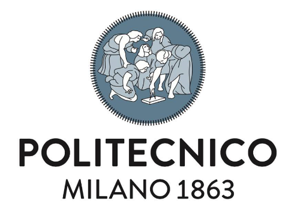
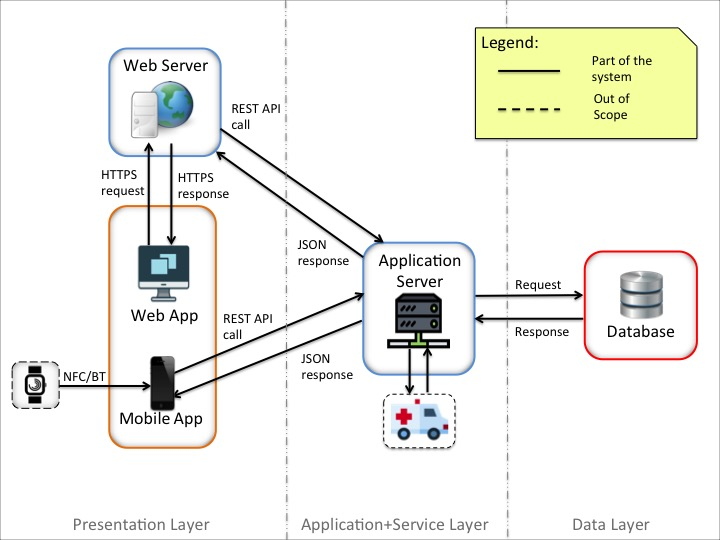

<p align="center">
    
</p>

# Software Engineering II Project (A.Y. 2018/2019)

This repository is owned by **Davide Rutigliano, Claudio Ferrante and Davide Matta** and contains all the documents needed to the developer of the proposed system.

<p align="center">
    
</p>

## Table of Contents
* [Documents](#documents)
    * [Preview](#preview-via-overleaf)
    * [Delivery](#delivery)
    * [Tools](#tools)
* [Software](#software)
    * [Architecture](#architecture)
    * [Build and Installation](#build-and-install-instructions)
    * [Tools](#tools-1)
* [Project Layout](#project-layout)
* [Contributors](#contributors)

---

# Documents
* First we propose a **Requirement Analysis and Specification Document** in order to describe and define both the problem and the model and also to point out requirements, dependencies and constraints of the proposed solution.

* Second folder is related to the **Design Document** in which we will describe all the design specifications and constraints such as architectural details, languages needed to implement the software previously analyzed and an integration and test plan.

* Then we moved on the **Implementation & Test** part in which we used these two documents and UML diagrams to build our [software application](#software).

## Preview via Overleaf
In this readme we provided to readers also a [read-only link](https://www.overleaf.com/read/scskfncqpsxf) to our overleaf project in order to have a pre-compiled version preview of all the documents we propose. In order to have the pdf of the desired document the reader should navigate to the folder, open the main file and recompile the document (e.g. to compile the RASD, the reader should go on *"RASD/main.tex"* and click *"Recompile"*).

## Delivery
In the folders named after the documents we included our code, in [Delivery Folder](DeliveryFolder/) instead there are pdf version of latex documents which in order to be recognized, will be named after the code folder too. For example *Requirement Analysis Document* is in RASD folder and the delivered file is called [RASD.pdf](DeliveryFolder/RASD.pdf). We did not included any other file such as the alloy model or UML diagrams because the reader can find them in the respective document folder.

## Tools
### Latex
In order to write such documents we decided for Latex, so we used **ShareLatex via Overleaf**. This choice allowed us to work to the document quickly and from remote and also to link the Latex project with this github repository.

### UML
We used a professional UML diagrams software [magicDraw](https://www.magicdraw.com/main.php?ts=download_demo&cmd_go_to_login=1&menu=download_demo&back_cmd=cmd_show) licensed by Politecnico di Milano.

---

# Software
[](https://travis-ci.com/DavideRutigliano/FerranteMattaRutigliano)
[](https://codecov.io/gh/DavideRutigliano/FerranteMattaRutigliano)

*TrackMe* is a company that wants to develop an ease of use health monitoring application which offers different services for both young and old people who needs to keep track of their personal data in order to to keep their health safe.

*TrackMe* allows Third-Party to access Individual's health data exploiting the functionality of *Data4help* service: Third-Parties can make individual requests that the Individuals can accept or reject, or group requests handled directly by TrackMe that approves them if it is able to properly anonymize the requested data. For sake of simplicity, we already assumed that TrackMe will accept any request for which the number of individuals whose data satisfy the request is higher than 1000. The application may also allow individual users to connect external devices such as smart-watches, specific pathology's monitoring devices or other types of external devices able to monitor health parameters with BT or NFC connection.

*Track4Run* provides to users signed in the application the possibility of creating runs: competition in which other individuals can either participate as *athletes* or watch as *spectators*. Additionally, this feature may exploits other services functionality for keeping track of athletes progresses and show their position to spectators through an interactive map.

## Architecture
<p align="center">
    
</p>

## Build and Install instructions
Instructions to build and install *TrackMe* are available [here](INSTALL.md).

## Tools
### Spring Framework
In order to develop the proposed system we decided to use Java as back-end and front-end language and in particular, we used [Spring](https://spring.io) Framework. This framework fits very well the architectural style of the proposed software solution, has proprietary implementation of the Model View Controller design patter and of several APIs and is very suitable for both provisioning and consuming RESTful services.

### Heroku
We used [Heroku](https://www.heroku.com/what) in order to deploy our server application over a remote host. More specific information about application server deployment can be found [here](https://github.com/DavideRutigliano/FerranteMattaRutigliano/deployments).

---

# Project layout
```
├── DD                  : Design Document Latex project
├── DeliveryFolder      : pdf version of delivered documents + pre-assembled client software apk(s)
├── Images              : common "Logo" images
├── ITD                 : Implementation and Testing Document Latex project
├── RASD                : Requirement Analysis and Specification Document Latex project
├── software            : TrackMe application source code
├── .travis.yml         : Travis-CI yaml configuration file
├── INSTALL.md          : build and installation instructions
└── README.md           : this file
```

# Contributors
:octocat: [Davide Rutigliano](https://github.com/DavideRutigliano)

:octocat: [Davide Matta](https://github.com/DadeKuma)

:octocat: [Claudio Ferrante](https://github.com/ClaudioFerrante95)
